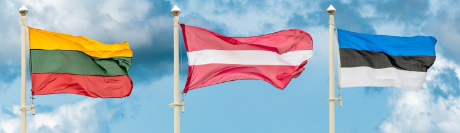

# *Baigiamojo darbo tema:* "2020-2022 m. Lietuvos kelių eismo įvykių statistika ir jos palyginimas su Latvija ir Estija"
___
### *Autoriai:* Diana Balan ir Jurgita Bžozovska
___
### *Tikslas -* išanalizuoti statistinius Lietuvos kelių eismo įvykių rodiklius, įvertinti jų kitimą 2020 - 2022 metų laikotarpyje ir palyginti žuvusių kelių eismo įvykiuose situaciją su Latvija ir Estija.
___
### *Darbo eiga:*
1. Darbas atliktas naudojantis Python.
2. Importuotos bibliotekos: Pandas, Request, Beautyfulsoup, Matplotlib, Seaborn, Numpy, Folium.
3. Naudoti duomenys:

 

4. Parengti duomenys analizei:
   * Atsisiųsti ir importuoti [Lietuvos](https://www.stat.gov.lt/) ir [Estijos](https://www.stat.ee/) statistiniai duomenys CSV formatu.
   * Nuskaityti [Latvijos](https://www.csdd.lv/) HTML duomenys ir išsaugoti CSV formatu.
   * Suvarkyti duomenys: pašalinti nereikalingi stulpeliai, eilutės, klaidingos reikšmės.
   * Agreguoti duomenys: grupuoti bei filtruoti duomenys, apjungtos lentelės, atliktos statistinės operacijos.
5. Grafiškai atvaizduoti duomenys.
6. Interpretuoti duomenys ir pateiktos išvados.
___
### *Išvados:*
1. Eismo įvykių, kuriuose nukentėjo (žuvo ar buvo sužeisti) žmonės, palyginimas parodė, kad daugiausiai įvykių 
įvyko 2022 m. (2861), mažiausiai 2021 m. (2784).
2. MAN REIKIA KURIAIS METAIS BUVO MAX ir KURIAIS METAIS MAŽIAUSIAI
3. 2020-2022 m.  eismo įvykiuose sužalotų ir žuvusių asmenys pagal amžiaus grupes pasiskirstė sekančiai: 
   * Daugiausiai nukentėjo moterų - 5624, vyrų - 4450.
   * Pagal amžiaus grupę - daugiausiąi įvykių patyrė vyrai, kurie priklauso 25–34 grupei (1118) 
ir moterys, kurios priklauso 65+ (948)
4. Sužeistieji   Dviračių vairuotojai ir keleiviai -2358 žuvusių - Pėstieji -111
5. Įvertinus 2020-2022 m. eismo įvykių pagal apskritis duomenis, daugiausiai jų įvyko Vilniaus apskrityje:
[2590 įvykiai](http://localhost:63342/main.py/name2.html?_ijt=u0jl7bnkmutvqn6mjrm0162f5n&_ij_reload=RELOAD_ON_SAVE).
6. Pagal 2020-2022 m. duomenis daugiausiai žuvusių kelių eismo įvykiuose yra Lietuvoje (455), mažiausiai - Estijoje (146).
    

